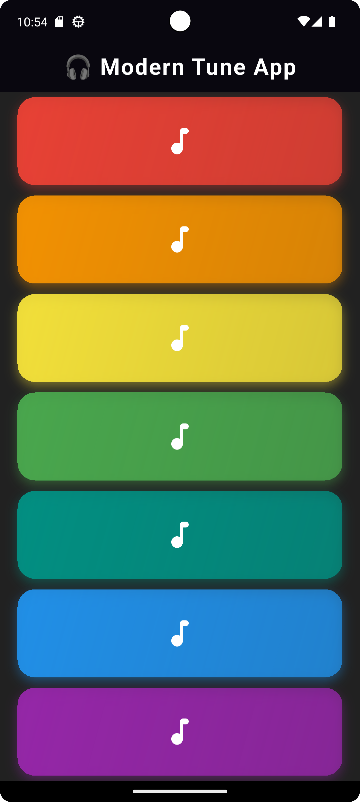

# 🎵 Tune App

A simple and modern Flutter app that plays musical notes when tapped. Built with ❤️ using Flutter and Audioplayers package.

---

## 🚀 Features

- Beautiful, colorful UI with responsive design.
- Tap to play smooth sound effects.
- Animated buttons with modern gradients and shadows.
- Built using clean and modular Flutter code.

---

## 📸 Screenshots

| Main Screen |
|-------------|
|  |

> *(Add your own screenshot from emulator in `assets/` folder if you'd like.)*

---

## 📦 Packages Used

- [flutter](https://flutter.dev/)
- [audioplayers](https://pub.dev/packages/audioplayers)

---

## 🎛️ Structure

